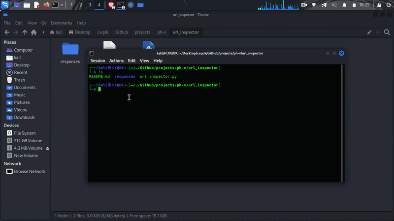
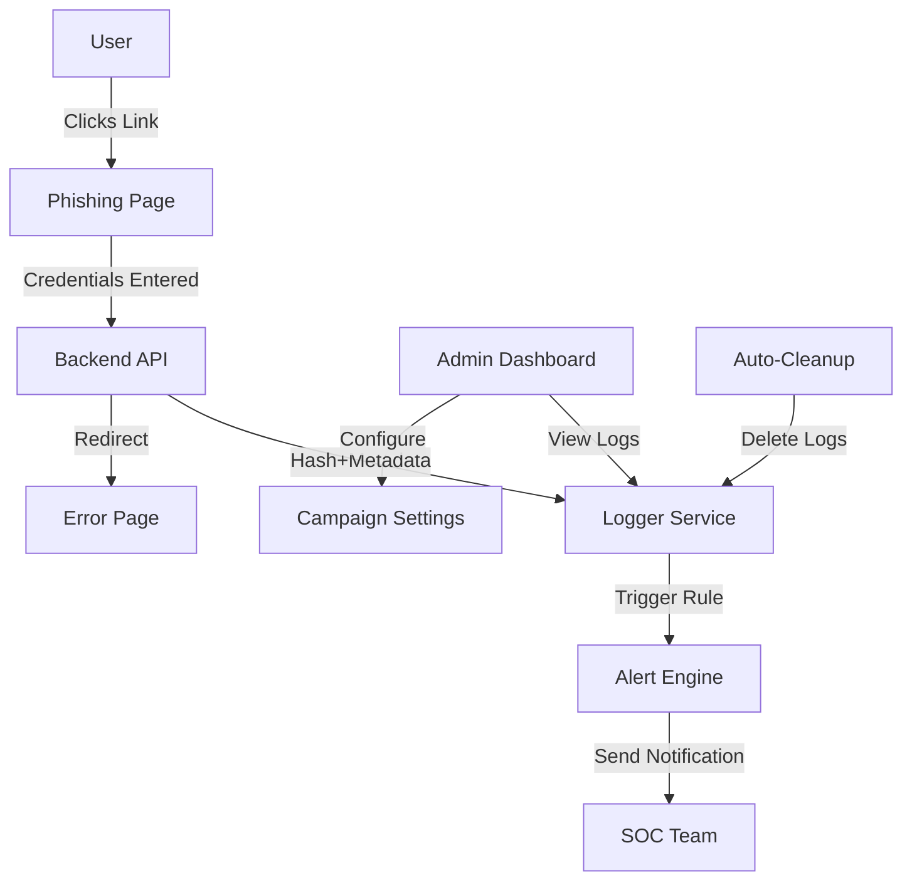

  <b>🔐 Next-Generation Phishing Simulation & Security Training Platform</b> 

---

  

  

---

## 🎥 Project Current Preview

  

**⚡ Watch the progress in action —**

---

## 🎯 Mission Statement

> *"To strengthen organizational security by simulating real-world threats in a controlled, ethical environment."*

This platform helps security teams:
- 🛡️ **Identify vulnerabilities** in human and AI security layers
- 📊 **Measure awareness** through realistic scenarios
- 🚨 **Test incident response** capabilities
- 📈 **Generate actionable insights** for training programs

---

## ✨ Key Features

| Feature | Description | Status |
|---------|-------------|--------|
| 🎭 **Multi-Platform Simulation** | Instagram, Facebook, Other's coming Soon..| ✅ |
| 🤖 **AI-Powered Analytics** | Behavioral pattern detection. AI Based. | 🚧 |
| 📱 **Responsive Design** | Mobile-optimized phishing pages | ✅ |
| 🔔 **Real-Time Alerts** | Bot notifications. Upcoming.... | ✅ |
| 🗺️ **Geo-Location Tracking** | IP-based location mapping | ✅ |
| 🧪 **A/B Testing** | Compare campaign effectiveness | 🚧 |
| 📊 **Dashboard Analytics** | Visual campaign statistics | ✅ |
| 🔒 **Auto Data Deletion** | No log files, All credentials will immediately delete. | ✅ |
| 🎮 **Gamification** | Security awareness scoring | 🚧 |
| 🌐 **Multi-Language** | 5+ language support | 🚧 |

---

## 🧬 Architecture

**⭐ Star this repo if you find it useful!**

